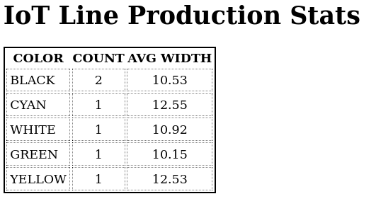

## Simulation of IoT Robot Communications

---

This is the repo for the IoT course I completed in Oulu University. This implements a small simulation of robot data
receiving and display.

### Deployment

> docker-compose up

Also convenience scripts are available:

- start
    - Start the server, pass first arg to `docker-compose`
- stop
    - Compose down the deployment
- build
    - Rebuild the deployment containers

### What it runs

- Robot Simulation (Python)
    - Randomly samples numbers and produces data
    - Color and width
    - Published to MQTT broker
- Server simulation (Python)
    - Receives data from MQTT broker
    - Aggregates data and sends to Redis
- Client (NodeJs)
    - Retrieves the aggregate data from Redis
    - Display a table
- Redis
    - Data storage stack
- Apache Mosquitto
    - MQTT broker
